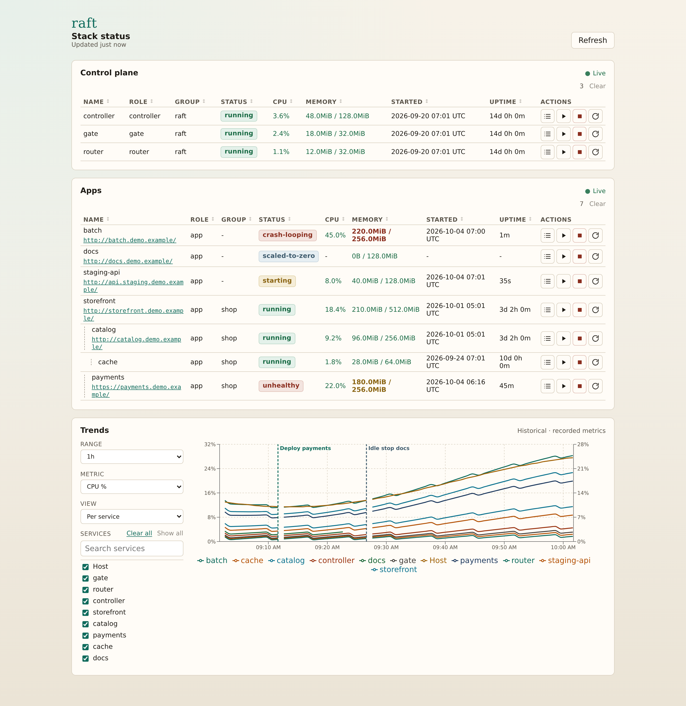
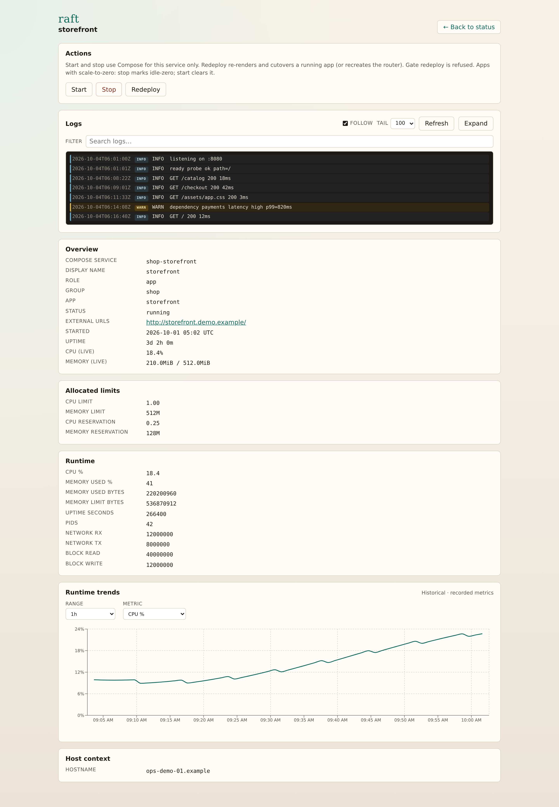

# raft

**Kubernetes-ish behaviour with Docker and nginx — for hosts that can’t spare a full cluster.**

A small control plane on your VPS: a public **gate**, an inner **router**, and your apps. You describe each service in `.raft/app.yaml` and drive everything with a kubectl-style CLI.

```text
Internet  →  gate  →  router (Host:)  →  your apps
```

Services stay in their own repos. On the VPS you `apply` a manifest; raft syncs sources, renders Compose/nginx, and cutovers without taking the public edge down (except when you change published ports with `raft gate recreate`).

## Install

```bash
curl -fsSL https://raw.githubusercontent.com/danielnachumdev/raft/main/install.sh | bash
```

Needs **Python 3.8+**, Docker, and Compose. Operator data lives under **`~/.raft/`** (override with `RAFT_DATA_HOME`). Later: `raft update` to refresh the CLI, `raft uninstall --yes` to remove everything.

Copy ideas from [`examples/settings.yaml`](examples/settings.yaml) into `~/.raft/settings.yaml` (logging, edge listeners, optional healing / metrics). For HTTPS Origin TLS, put PEMs under `~/.raft/certs/<app>/` before the first deploy.

## Quick start

```bash
raft doctor
raft apply --file .raft/app.yaml --ref "$SHA"
# or: raft apply --git git@github.com:org/my-site.git --ref "$SHA"
raft get apps
raft status
raft serve   # localhost ops UI — tunnel from your laptop (below)
```

`apply` registers the App and deploys by default — first boot and later releases use the same command. Pass `--env` / `--env-file` for `${VAR}` and `${{ if }}` (see [`examples/http-only-site/optional-block.snippet.yaml`](examples/http-only-site/optional-block.snippet.yaml) and `AGENTS.md`). Full-line `#` comments are not preprocessed.

## See your stack in a browser

When SSH and `docker stats` are not enough, run **`raft serve`**. One process on the VM opens a localhost ops dashboard: live status, quick actions, logs, and resource trends. It never listens on the public gate — you tunnel it to your laptop.

<p align="center">
  
</p>

<p align="center"><em>Stack status — control plane + apps, then historical Trends from the controller.</em></p>

**What you get**

- **Live tables** for the edge (`gate` / `router` / `controller`) and every applied app — health badges, CPU/memory vs limits, Started + Uptime, public URLs when you have a `publicHost`
- **Quick actions** on each row: open logs, start, stop, redeploy (with confirmations)
- **Trends** — CPU and memory history recorded by the always-on controller, with time range and service filters

Open one service for the full picture: actions, live logs, overview, allocated limits, and runtime charts.

<p align="center">
  
</p>

<p align="center"><em>Service detail — actions, follow logs, overview, limits, and historical runtime charts.</em></p>

### Start the dashboard

```bash
raft serve                 # http://127.0.0.1:8787/
raft serve --port=8787     # optional
raft serve --stop          # stop an already-running serve on that port

# on your laptop (pick one):
ssh -L 8787:127.0.0.1:8787 USER@VM_HOST
gcloud compute ssh VM_NAME --zone=ZONE -- -L 8787:127.0.0.1:8787
```

Then open `http://127.0.0.1:8787/`. Stop with Ctrl+C or `raft serve --stop`.

Same facts as `raft status` / `raft logs` — in a UI you can leave open while you operate.

## Common commands

| Command | When |
|---------|------|
| `raft apply --file …` / `--git …` | Register + deploy (default path) |
| `raft doctor` | Health check + fix hints |
| `raft status` | CPU/memory snapshot (`--live` to watch) |
| `raft serve` | Localhost ops dashboard (default `:8787`); `--stop` to terminate |
| `raft logs [name…]` | Container stdout/stderr (`--tail N`; `-f` / `--follow`) |
| `raft redeploy <app>` | Cutover when the app is already running |
| `raft gate recreate` | After changing published edge ports in settings |
| `raft up` / `raft down` | Bring the whole stack up or tear it down |

## Examples

Copy-paste samples in **[`examples/`](examples/)**: operator settings and scenarios (`http-only-site`, `https-origin-site`, `http-plus-stream`, `host-published-ports`, `grouped-volume-app`).

## Develop

```bash
git clone https://github.com/danielnachumdev/raft.git && cd raft
uv sync --extra dev
uv run pytest
uv run raft -- --help
```

Dashboard UI source lives in **`web/`** (React + Vite). Runtime ships static files only — after FE changes: `cd web && npm ci && npm run build` (writes `src/raft/share/serve/spa/`). Working on the codebase? See **[AGENTS.md](AGENTS.md)**.
