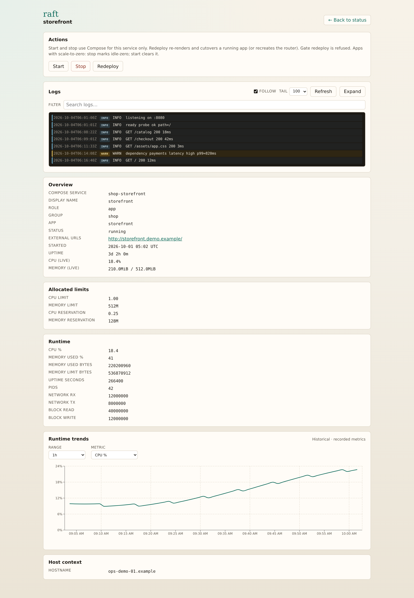

# raft

**Deploy like you have a control plane — without running Kubernetes.**

raft sits between a full cluster and hand-rolled Docker Compose + nginx. You describe each service in `.raft/app.yaml`; raft turns that desired state into Compose and nginx artifacts, then deploys and cutovers them on a single VPS — light on resources, heavy on operator UX.

<p align="center">
  
</p>

<p align="center"><em>Localhost ops UI — live status, actions, and resource trends for the edge and every applied app.</em></p>

## The problem

Kubernetes is real infrastructure. On a solo VPS it is usually more platform than product.

Raw Compose and nginx get you online fast — until Host routing, TLS, multi-app stacks, and safe releases become a second job you maintain by hand.

## What raft is

A small control plane on your host: a public **gate**, an inner **router**, and your **apps**. Traffic hits the gate, the router sends it by `Host`, and each applied App runs as its own Compose service.

You keep services in their own repos. On the VPS you `apply` a manifest. raft syncs sources, regenerates the Compose/nginx artifacts under `~/.raft/`, and cutovers the running service — without taking the public edge down for a normal release.

## What you get

- **One ship command** — `raft apply` registers desired state and deploys (first boot and later releases)
- **Managed artifacts** — Compose apps, upstreams, and gate/router nginx are generated for you, not edited by hand each release
- **Adaptive manifests** — apply-time `${VAR}` / `${{ if }}` and `--env` so one `.raft/app.yaml` can serve stages (see [`docs/app-manifest.md`](docs/app-manifest.md))
- **Safer cutovers** — tmp cutover + router reload; published edge ports only need `raft gate recreate`
- **Operator feedback** — `raft doctor` with fix hints; `raft status` / `raft logs` for the live plane
- **Localhost ops UI** — `raft serve` for tables, actions, logs, and trends (never on the public gate)
- **Optional scale-to-zero and healing** — idle-stop/wake when you declare `spec.scaling`; healing stays in settings

## Try it

Needs **Python 3.8+**, Docker, and Compose.

```bash
curl -fsSL https://raw.githubusercontent.com/danielnachumdev/raft/main/install.sh | bash
```

Operator data lives under **`~/.raft/`** (override with `RAFT_DATA_HOME`). Copy ideas from [`examples/settings.yaml`](examples/settings.yaml) into `~/.raft/settings.yaml`. For `tls: origin`, put PEMs under `~/.raft/certs/<app>/` before the first deploy.

```bash
raft doctor
raft apply --file .raft/app.yaml --ref "$SHA"
# or: raft apply --git git@github.com:org/my-site.git --ref "$SHA"
raft status
```

Copy-paste scenarios live in [`examples/`](examples/). Manifest env / conditional blocks: [`docs/app-manifest.md`](docs/app-manifest.md).

Later: `raft update` to refresh the CLI, `raft uninstall --yes` to remove everything.

## How a release feels

CI (or you) points at a commit and applies:

```bash
raft apply --file .raft/app.yaml --ref "$SHA"
```

Same command for first boot and later cutovers. raft syncs, renders, and switches traffic through the router. Changing published edge listeners in settings is the exception — that needs `raft gate recreate` (brief edge downtime).

## Ops UI

When a terminal snapshot is not enough, run **`raft serve`**. One localhost process: live tables, quick actions, logs, and trends. It never listens on the public gate — open it on the host, or forward `127.0.0.1:8787` from wherever you operate.

<p align="center">
  
</p>

<p align="center"><em>Service detail — actions, follow logs, overview, limits, and historical runtime charts.</em></p>

```bash
raft serve                 # http://127.0.0.1:8787/
raft serve --stop
```

## Common commands

| Command | When |
|---------|------|
| `raft apply --file …` / `--git …` | Register + deploy (default path) |
| `raft doctor` | Health check + fix hints |
| `raft status` | CPU/memory snapshot (`--live` to watch) |
| `raft serve` | Localhost ops dashboard (default `:8787`) |
| `raft logs [name…]` | Container stdout/stderr (`-f` to follow) |
| `raft redeploy <app>` | Cutover when the app is already running |
| `raft gate recreate` | After changing published edge ports |
| `raft up` / `raft down` | Bring the whole stack up or tear it down |

## Develop

```bash
git clone https://github.com/danielnachumdev/raft.git && cd raft
uv sync --extra dev
uv run pytest
uv run raft -- --help
```

CI runs the suite across Python 3.8–3.13. Dashboard source is in **`src/spa/`** (build writes `src/raft/share/serve/spa/`). Working on the codebase? See **[AGENTS.md](AGENTS.md)**.
